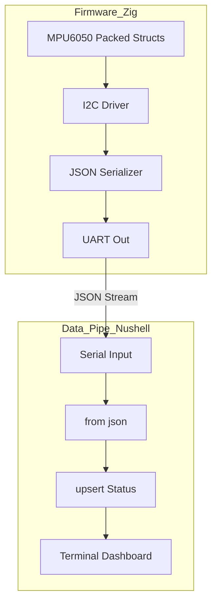

# Zig-Systems Accelerometer Monitor

[](https://ziglang.org)
[](https://www.nushell.sh)
[](https://github.com/ashishrai12/LCD_Test_Accelerometer/actions)

A next-generation systems programming demonstration using **Zig** for firmware and **Nushell** for data orchestration. This project replaces the overhead of Python and C++ with explicit, memory-efficient systems tools.

---

## Technical Philosophy

### 1. No Hidden Control Flow
Unlike C++ or Python, Zig ensures that every CPU instruction is visible. There are no hidden allocations, no hidden function calls (via operators), and no preprocessor magic. What you see in the code is exactly what the hardware executes.

### 2. Comptime Mastery
The firmware leverages Zig's `comptime` to perform JSON template validation and register configuration at compile time, ensuring zero runtime overhead for static configurations.

### 3. Bit-Perfect Hardware Mapping
Using Zig's **packed structs**, we map the MPU6050 registers with bit-level precision, eliminating the need for manual bit-shifting and masking logic found in traditional C drivers.

---

## System Architecture



---

## Project Structure
```text
LCD_Test_Accelerometer/
├── src/
│   ├── main.zig        # Firmware entry & JSON logic
│   ├── registers.zig   # MPU6050 Packed Struct registers
│   └── uart.zig        # Low-level UART implementation
├── scripts/
│   └── monitor.nu      # Nushell serial monitor & processor
├── legacy/
│   └── c_version/      # Archived original C firmware
└── README.md
```

---

## Getting Started

### 1. Build Firmware (Zig)
Requires Zig 0.11.0+.
```bash
zig build-exe src/main.zig -target avr-freestanding -mcpu atmega328p
```

### 2. Monitor Data (Nushell)
Ensure `nu` is installed.
```bash
nu scripts/monitor.nu /dev/ttyUSB0
```

---

## Data Protocol
The firmware outputs a minified, line-delimited JSON format to minimize UART bandwidth while maintaining high parseability:
```json
{"x":102,"y":-45,"z":16000}
```

---

## License
MIT


