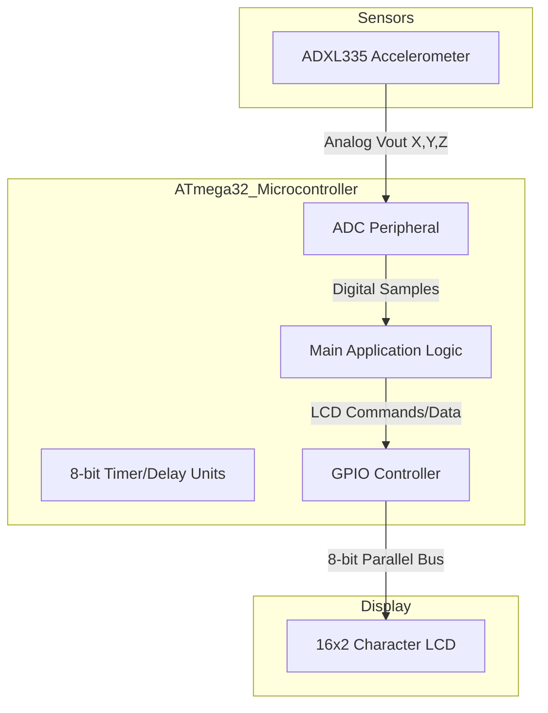
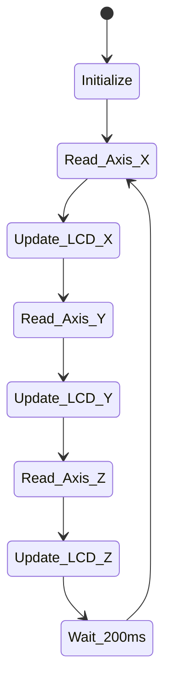

# LCD Test Accelerometer (AVR-Based)

[](https://opensource.org/licenses/MIT)
[](https://www.microchip.com/en-us/products/microcontrollers-and-microprocessors/8-bit-mcus/avr-mcus)
[](https://github.com/ashishrai12/LCD_Test_Accelerometer/actions)

A professional, modular embedded system project for real-time accelerometer data visualization on a 16x2 LCD using ATmega16/32 microcontrollers.

---

## System Overview

This project interfaces an analog accelerometer (like the ADXL335) with an AVR microcontroller. The system samples three analog channels (X, Y, Z), processes the data through the internal 10-bit ADC (configured for 8-bit precision), and displays the raw values on a character LCD.

### System Architecture


### Main Loop Logic


---

## Directory Structure
```text
LCD_Test_Accelerometer/
├── .github/workflows/  # CI/CD pipeline definitions
├── drivers/           # Hardware Abstraction Layer
│   ├── accel.c/h      # Accelerometer & ADC configuration
│   └── lcd.c/h        # HD44780 LCD driver (8-bit mode)
├── src/               # Application source
│   └── main.c         # System integration & main loop
├── legacy/            # Original project files
├── hardware_setup.md  # Detailed wiring & calibration guide
├── .gitignore         # Build & IDE exclusion rules
└── README.md          # Project documentation
```

---

## Hardware Setup

### Component List
- **Microcontroller:** ATmega16 or ATmega32 (running at 16MHz)
- **Display:** 16x2 Character LCD (HD44780 compatible)
- **Sensor:** Analog Accelerometer (e.g., ADXL335)
- **Oscillator:** 16.000 MHz Crystal with 22pF capacitors

### Pin Mapping Table

| Component | MCU Pin | Function | Description |
| :--- | :--- | :--- | :--- |
| **LCD RS** | PORTB.0 | Control | Register Select |
| **LCD RW** | PORTB.1 | Control | Read/Write (tied to GND optionally) |
| **LCD EN** | PORTB.2 | Control | Enable/Strobe |
| **LCD D0-D7** | PORTC.0-7 | Data | 8-bit Data Bus |
| **Accel X** | PORTA.0 | Input | ADC Channel 0 |
| **Accel Y** | PORTA.1 | Input | ADC Channel 1 |
| **Accel Z** | PORTA.2 | Input | ADC Channel 2 |

---

## Software Setup

### ADC Configuration Details
The project utilizes the internal ADC with the following settings:
- **Reference Voltage:** AVCC with external capacitor at AREF pin.
- **Data Alignment:** Left Adjusted (`ADLAR=1`) to allow direct 8-bit reading from `ADCH`.
- **Prescaler:** 128 (resulting in 125kHz ADC clock at 16MHz CPU clock).

### Build Instructions
If using **avr-gcc** via command line:
```bash
# 1. Compile drivers
avr-gcc -mmcu=atmega32 -DF_CPU=16000000UL -Os -c drivers/lcd.c -o drivers/lcd.o
avr-gcc -mmcu=atmega32 -DF_CPU=16000000UL -Os -c drivers/accel.c -o drivers/accel.o

# 2. Compile main and link
avr-gcc -mmcu=atmega32 -DF_CPU=16000000UL -Os src/main.c drivers/lcd.o drivers/accel.o -o main.elf

# 3. Create Hex file
avr-objcopy -j .text -j .data -O ihex main.elf main.hex

# 4. Flash (Optional - using avrdude)
avrdude -c usbasp -p m32 -U flash:w:main.hex:i
```

---

## System Documentation
For detailed information on calibration, sensor offsets, and hardware wiring, please refer to:
**[Hardware Setup & Calibration Guide](hardware_setup.md)**

---

## License
This project is licensed under the MIT License - see the [LICENSE](LICENSE) file for details.

## Contributing
Contributions are welcome! Please feel free to submit a Pull Request.


